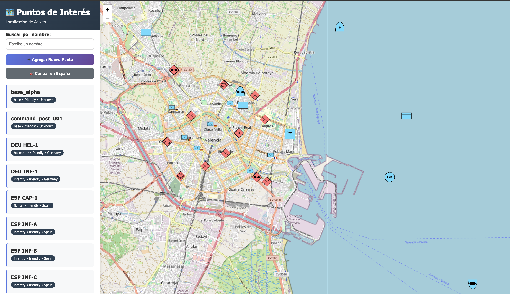
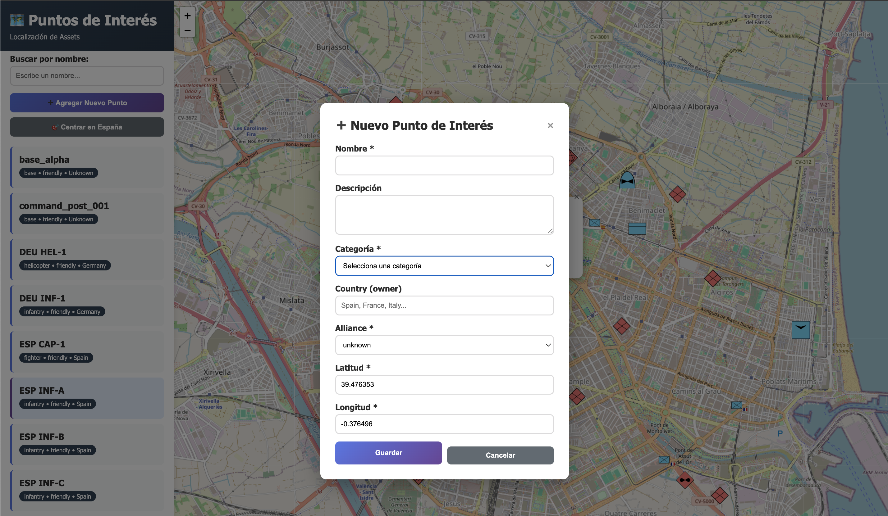
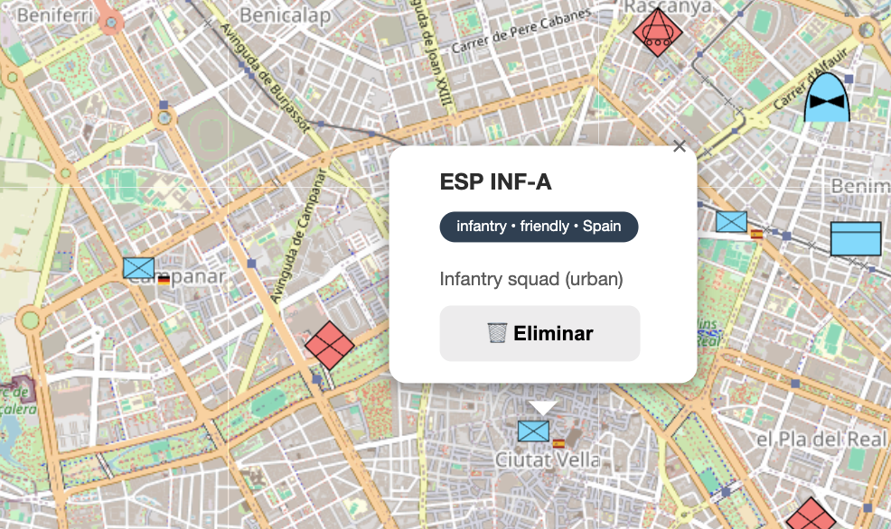

# 🗺️ Military Points of Interest Map

A web application for managing and visualizing military entities on an interactive map using **Leaflet**, **Node.js**, **Express**, and **PostgreSQL/PostGIS**.
The system supports NATO APP-6 compliant symbols, affiliation modeling, and multi-nation forces.

---

## 📑 Description

**mapa-puntos-interés** provides a lightweight military geospatial layer designed for integration with external systems such as **TIFDA**.
It enables users to create, edit, visualize, delete, and classify military assets with accurate geospatial storage (PostGIS) and professional-grade symbology (NATO APP-6).

The project includes a full REST API and a minimal frontend map for situational awareness and operational testing.

---

## 📁 Project Structure

```
mapa-puntos-interes/
├── config/              # Database configuration
│   └── database.js
├── delete-tifda-recipients.js
├── docker-compose.yml
├── models/              # Data models (PostGIS queries)
│   └── puntoInteres.js
├── postman/
│   └── Puntos_Interes_API.postman_collection.json
├── public/
│   ├── css/
│   │   └── styles.css
│   ├── icons/           # NATO APP-6 icon set (organized by alliance)
│   │   ├── friendly/
│   │   ├── hostile/
│   │   ├── neutral/
│   │   └── unknown/
│   ├── images/          # Screenshots
│   ├── index.html
│   └── js/
│       └── app.js
├── routes/
│   └── puntosInteres.js
├── scripts/             # Database initialization & migration scripts
│   ├── init-db.js
│   ├── migrate-categories.js
│   └── update-schema.js
├── server.js
└── package.json
```

---

## ⚡ Quick Setup

### Prerequisites

* Docker Desktop
* Node.js 18+
* npm

### First-time Setup

```bash
# 1. Start Docker Desktop
open -a Docker

# 2. Start PostgreSQL
docker compose up -d

# 3. Initialize the database schema + sample data
node scripts/init-db.js

# 4. Start the map server
npm install
npm run dev
```

Access the application at:

👉 **[http://localhost:3000](http://localhost:3000)**

---

## 🔁 Daily Workflow

### Starting

```bash
# Terminal 1 — PostgreSQL
docker compose up -d

# Terminal 2 — Map server
npm run dev

```

### Stopping

```bash
Ctrl+C    # stop map server
docker compose down
```

### Delete elements of TIFDA demo
When running the demo of the [TIFDA](https://github.com/MartinezAgullo/genai-tifda) project a set of elements will be automatically created and saved into the mapa. To delete them run:
```bash
node delete-tifda-recipients.js
```
---

## ⚙️ Configuration (.env)

Create a `.env` file in the project root:

```env
DB_HOST=127.0.0.1
DB_PORT=5432
DB_NAME=puntos_interes_db
DB_USER=postgres
DB_PASSWORD=xxxx
PORT=3000
NODE_ENV=development
```

---

## 🌐 API Endpoints

| Method | Endpoint                                  | Description                      |
| ------ | ----------------------------------------- | -------------------------------- |
| GET    | `/api/puntos`                             | Get all points                   |
| GET    | `/api/puntos/:id`                         | Get point by ID                  |
| GET    | `/api/puntos/categoria/:categoria`        | Filter by category               |
| GET    | `/api/puntos/cerca/:lng/:lat?radio=50000` | Spatial query (radius in meters) |
| POST   | `/api/puntos`                             | Create a new point               |
| POST   | `/api/puntos/batch`                       | Create multiple points           |
| PUT    | `/api/puntos/:id`                         | Update a point                   |
| DELETE | `/api/puntos/:id`                         | Delete a point                   |
| GET    | `/api/puntos/meta/categorias`             | List allowed categories          |

**Example**

```bash
curl http://localhost:3000/api/puntos
```

---

## ⭐ Features

### ✓ Military Categories

All entities use a normalized category enum:

```
missile, fighter, bomber, aircraft, helicopter, uav,
tank, artillery, ship, destroyer, submarine, ground_vehicle,
apc, infantry, person, base, building, infrastructure, default
```

Each point also includes:

* **country** (e.g., Spain, France, Germany, Portugal, Unknown)
* **alliance** = friendly | hostile | neutral | unknown
* **altitude, priority, description, type, identifier**
* **PostGIS geometry**

### ✓ NATO APP-6 Symbology (automatic)

The map automatically selects the correct symbol based on:

* **Alliance** (`friendly`, `hostile`, `neutral`, `unknown`)
* **Category**
* **Country** (when available: e.g., `infantry_spain.svg` → fallback `infantry.svg`)

Details are provided in [**README_symbols.md**](https://github.com/MartinezAgullo/mapa-puntos-interes/tree/main/public/icons/README.md).

### ✓ Integrated Frontend

* Real-time map interaction
* Add/edit/delete points
* Category & alliance filtering
* Popup details
* Auto-fit map to entities


**APP-6 Symbols in Map View**


**Create Item**


**Delete Item**


### ✓ Technologies

* **Backend:** Node.js + Express
* **Database:** PostgreSQL + PostGIS (Docker)
* **Frontend:** HTML5, CSS3, vanilla JS
* **Mapping:** Leaflet + OpenStreetMap
* **Icons:** NATO APP-6 (country-aware variants)

---

## 📄 License

**GNU General Public License (GPL) 3.0**


<!-- 
tree -I "__pycache__|__init__.py|uv.lock|README.md|docs|node_modules"
-->
